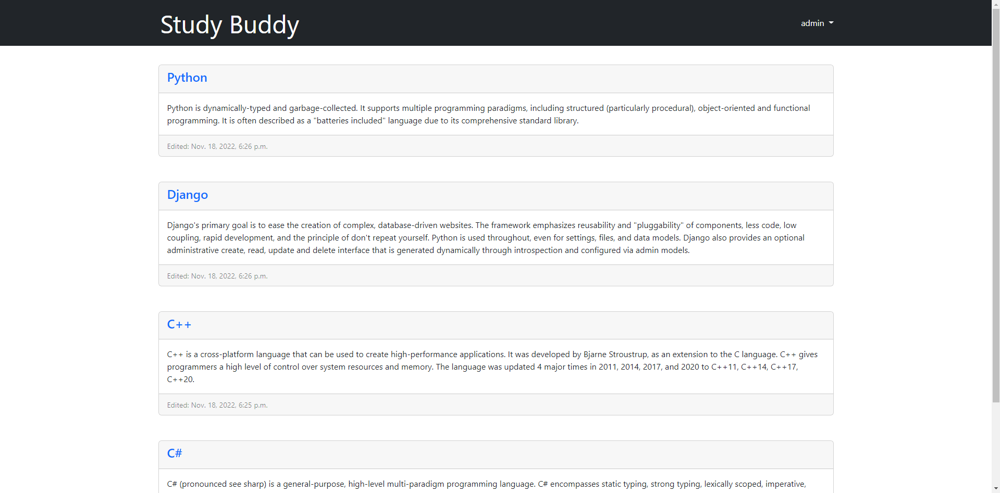
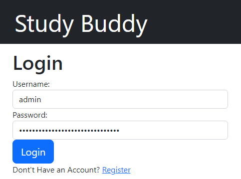
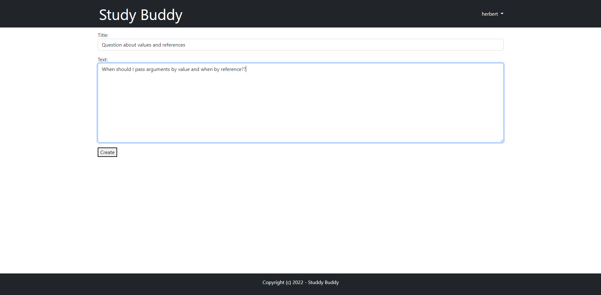
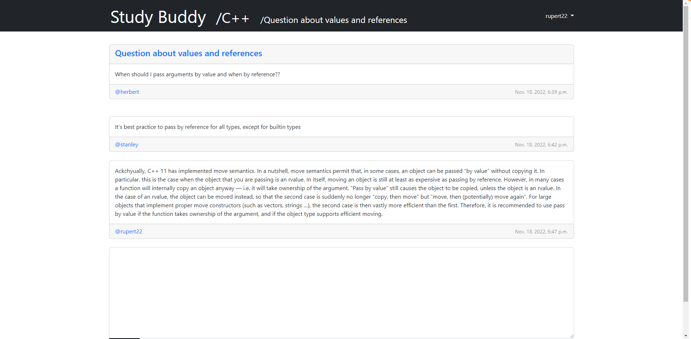

# Studybuddy - Forum Website

## Description

Studybuddy is a simple proof of concept forum website made as a learning project. It is  made with django framework. It implements full user authentication functionality, ability to create user posts and to interact with other users through leaving comments.

---
## Getting Started

### Dependencies

* django

### Installing

* Clone this repo
* Create admin
```
python3 manage.py createsuperuser
```
Then you should be able to run server. At `localhost:8000/admin` you can add new boards.


---
## Features

* User authentication



* Users can start discussions by making posts



* Leave comments under posts



---
## Author Info
* Email - giancarlo.bedek@hotmail.com